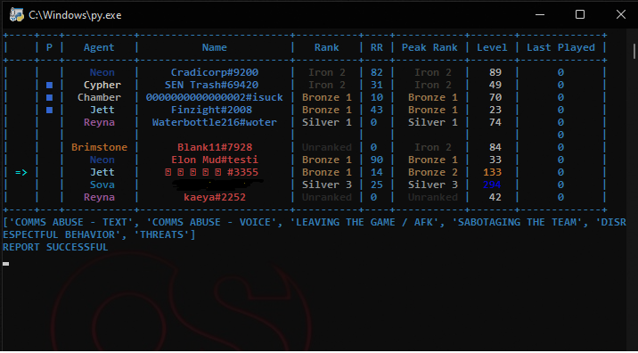
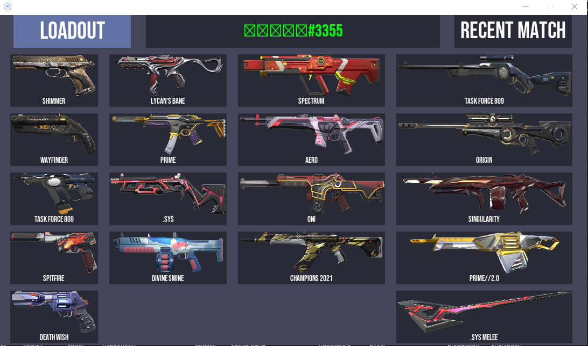
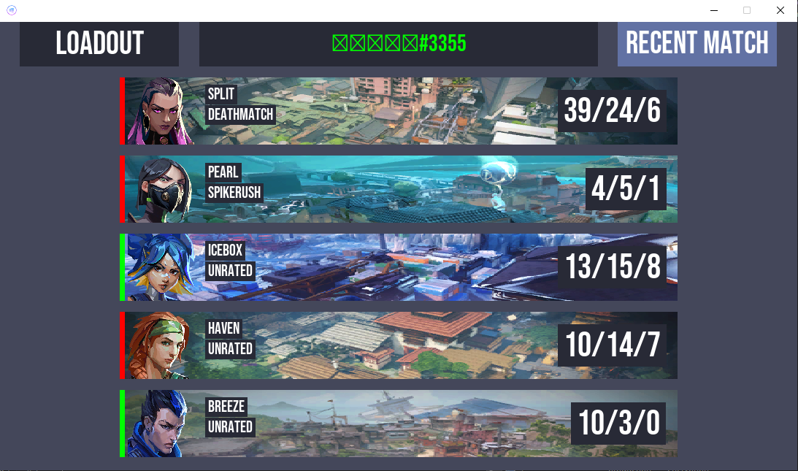

    
<h3 align="center"> VALORANT rank tool</h3>

    Application to view player ranks and other info in a live Valorant Match

    

    
    
    
    

    
## Current Features
1) **PLAYER PARTY/RANK/RATING/PEAKRANK**
2) **PLAYER LOADOUT**
3) **PLAYER RECENTMATCH**
4) **FIX HIDDEN PLAYER NAME/ACCOUNT LVL**
5) **ONE CLICK REPORT (f12 key)**
6) **DODGE WITHOUT EXITING GAME (end key 2x)**

##

  <ol>
    <li><a href="#about-the-project">About The Project</a></li>
    <li><a href="#usage">Usage</a></li>
    <li><a href="#disclaimer">Disclaimer</a></li>
  </ol>

    
## About The Project

 
 
 

## Usage
 **VALORANT must be open**. 
 **Arrow key to select player**. 
 **Enter key to open Loadout/Recent Match**. 

### Bundled Release:

1) Download the [release](https://github.com/putotoy/VALORANT-rank-tool/releases/latest).
2) Run vRT.exe.

## Disclaimer

 THIS PROJECT IS NOT ASSOCIATED OR ENDORSED BY RIOT GAMES. Riot Games, and all associated properties are trademarks or registered trademarks of Riot Games, Inc.
    
 Whilst effort has been made to abide by Riot's API rules; you acknowledge that use of this software is done so at your own risk.
